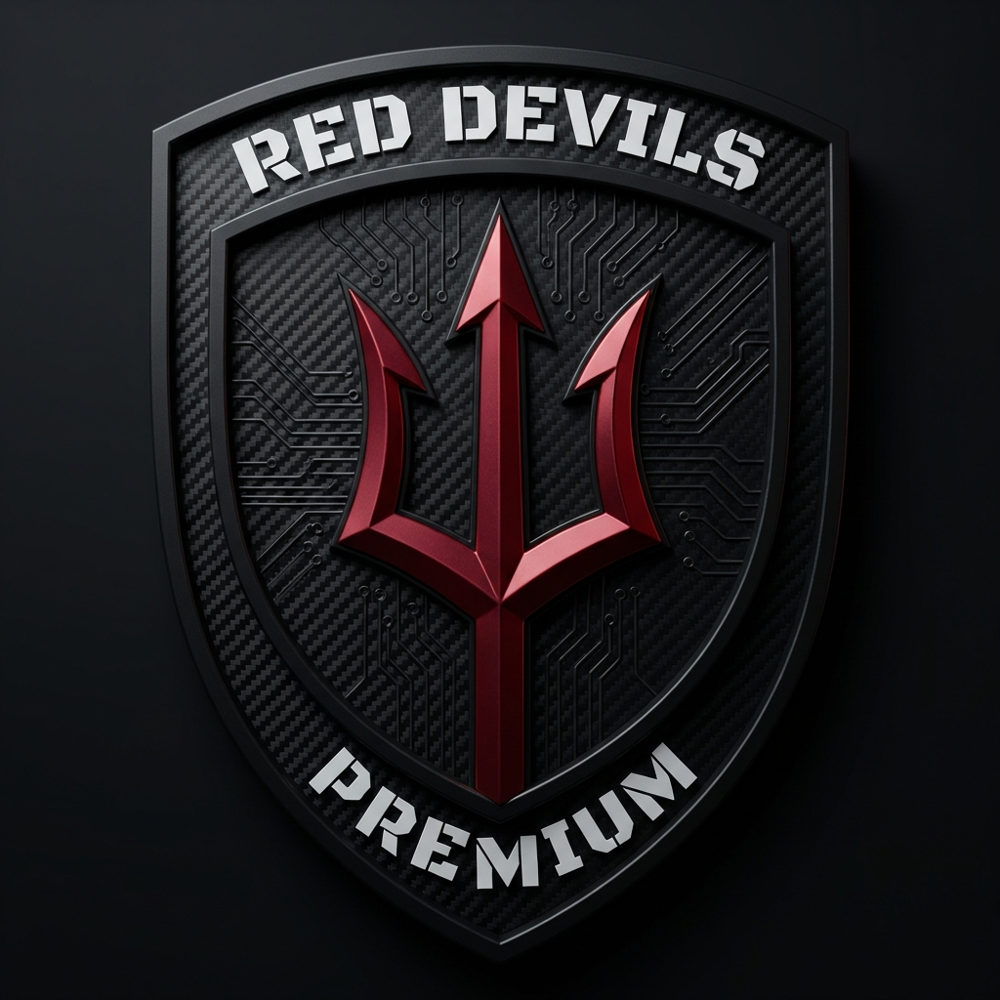
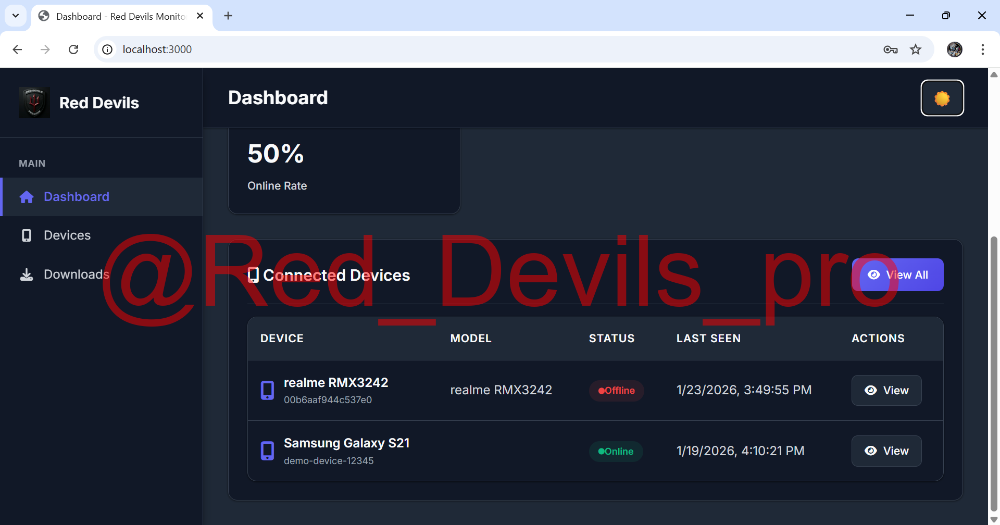
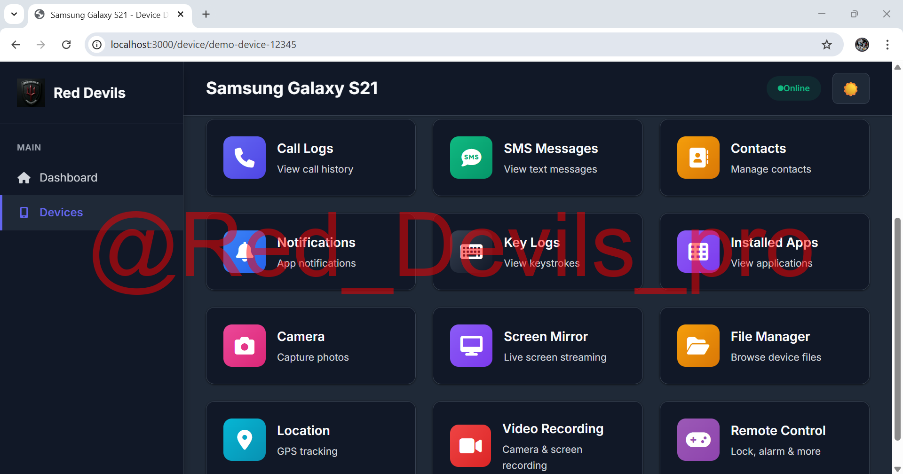
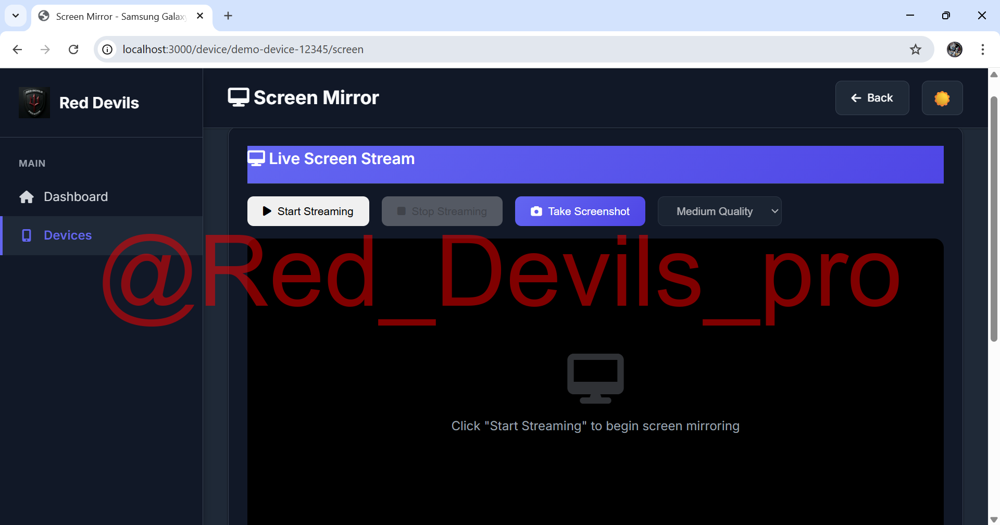
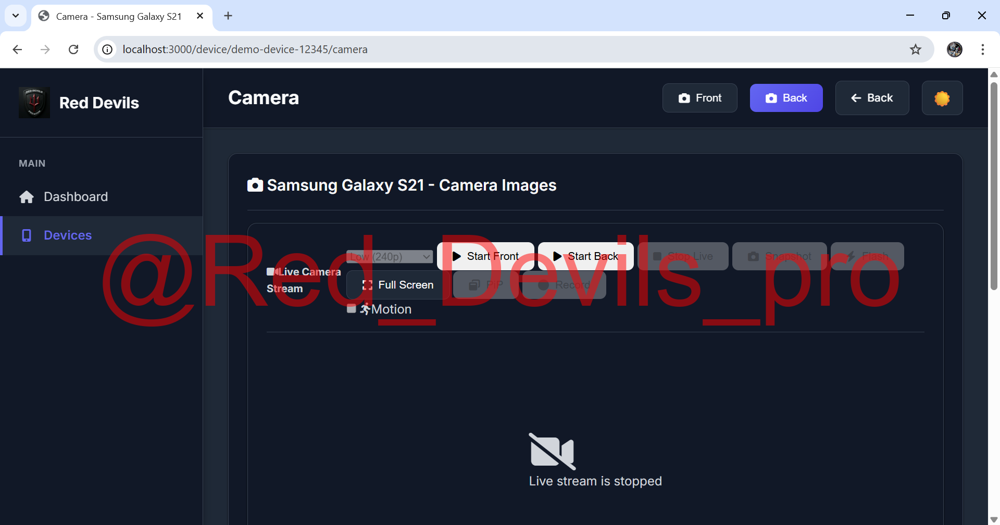
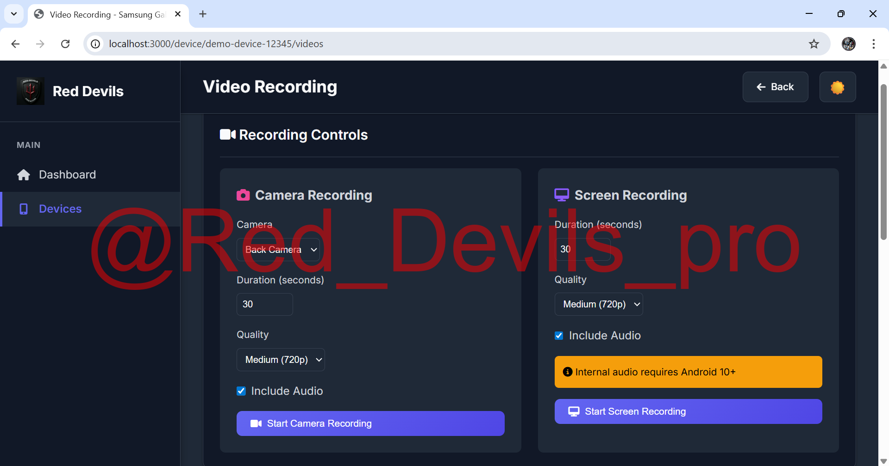

  

# Red Devils Rat Premium

<h2 align="center"> JOIN RED DEVILS TEAM</h2>

  
  <a href="https://t.me/+BjDxD0_10BszMDk1">
    

  

<h2 align="center"> VIDEO TUTORIAL </h2>

  

## Donete Us and get Premium version free 

*   **BTC**: `bc1q303c2537ka89g6puqtr5au75zx2599p4t06dcp`

*   **USDT**: `0x51DC6f213bB6596B7E5268D954282E94F516864B`

 **TRX**: `TBTjXi2BmmPzvFyJFaU2w59zdKGgmHn8Wy`

For sponsorship inquiries, please contact me on **[Telegram](https://t.me/+BjDxD0_10BszMDk1)**.

## **feature list**

- Call log ( incoming or outgoing call )
- SMS ( received SMS and send SMS SIM 1 or SIM 2 )
- Get Connect list
- Notification listener
- Send notification 
- Advance keylogger 
- View install app ( launch app, uninstall app )
- Camera ( live and photo camera front and back )
- Live Screen streaming 
- Take Screenshot 
- File manager ( download, delete, upload, make folder )
- Live location 
- Video recording ( screen recording, camera recording 
With audio)
- **Remote control **
- Lock unlock device 
- Run shell command 
- Text to speak 
- Flashlight on off
- Check permission 
- Clipboard ( get and set )
- Wipe device 
- Self destroyed
# Screenshot

